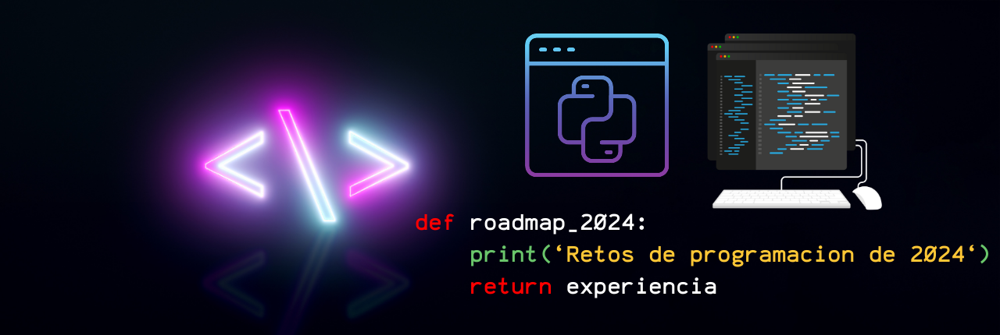

# Roadmap retos de programación semanales 2024

* Ejercicios y retos con los que practicar lógica de programación.
* Soluciones centradas en Pyhton.

## Información importante

* Basado en el proyecto de [Mouredev](https://github.com/mouredev) -  [Roadmap - Retos de programación 2024](https://github.com/mouredev/roadmap-retos-programacion)

* Consulta la [web oficial](https://retosdeprogramacion.com/roadmap) para más información.
